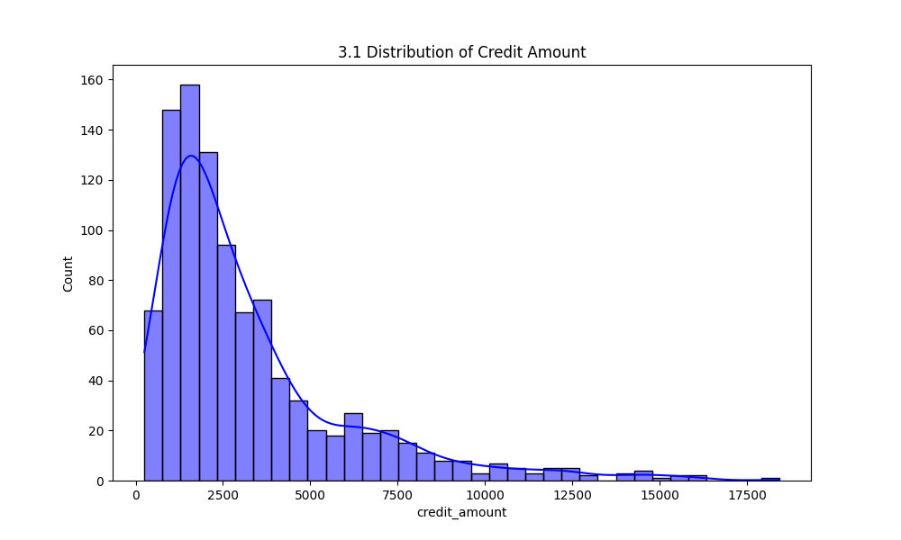
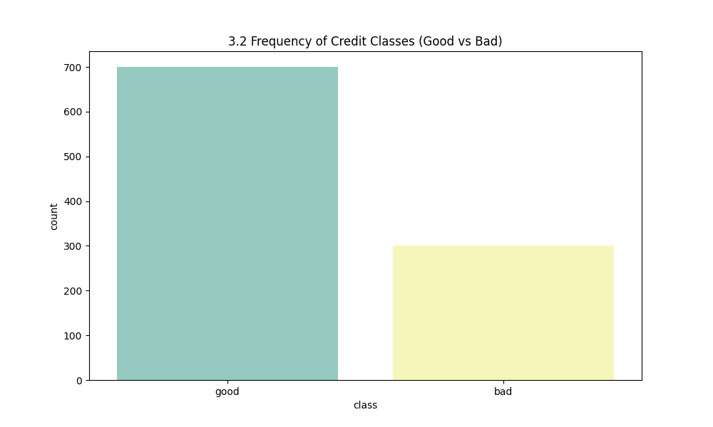
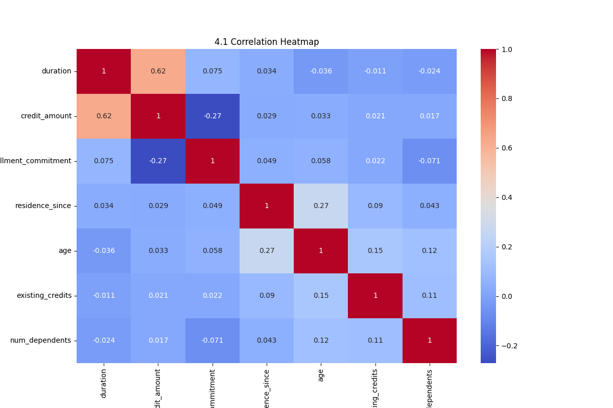
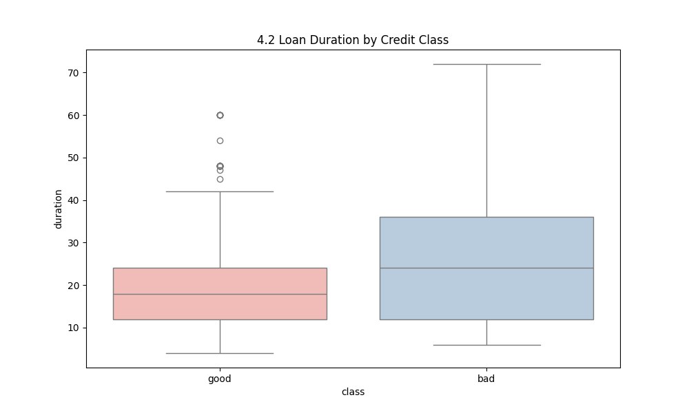

📊 독일 신용 데이터 CREDIT-G 분석 보고서 📊

##**1. 서론 (Introduction)**

* **1.1 분석 배경 및 목적:** 

본 프로젝트는 독일 신용 데이터credit-g를 활용하여 대출 신청자의 신용 위험을 예측하기 위한 데이터 분석 실습입니다. 비즈니스 관점에서 부실 대출을 최소화하기 위한 핵심 변수를 식별하는 것이 목적입니다.

* **1.2 데이터 셋 설명:** 

OpenML(ID: 31)에서 수집된 데이터로, 1,000개의 레코드와 20개의 독립 변수, 1개의 타겟 변수(class)로 구성되어 있습니다.

* **1.3 주요 분석 질문:**

    * 대출 금액이 클수록 신용 위험도가 높은가?
    * 대출 기간과 신용 등급 사이에 상관관계가 있는가?
    * 연령대별로 신용 등급의 차이가 존재하는가?

## **2. 데이터 프로파일링 및 기초 탐색 **

* **2.1 데이터 명세 확인:** 

전체 1,000건의 데이터와 21개의 컬럼을 확인하였습니다. (int64 및 object 타입 혼재)

* **2.2 결측치(Missing Value) 분석:** 

`df.isnull().sum()` 확인 결과 모든 컬럼에서 결측치가 0으로 나타났습니다. 따라서 별도의 제거 및 대체 전략은 필요하지 않았습니다.

* **2.3 기초 통계량 분석:** 
대출 금액의 평균은 3,271이며, 표준편차가 2,822로 변동성이 매우 큽니다.

* **2.4 데이터 정제 결과:** 
중복 데이터는 발견되지 않았으며, 수치형 데이터의 이상치(Outlier)는 시각화를 통해 확인하였습니다.

---

## **3. 변수별 개별 특성 분석**

### **3.1 수치형 변수 분석 (대출 금액)**

* **왜도와 첨도:** 대출 금액 분포는 오른쪽으로 긴 꼬리를 가진 형태(Positive Skewness)를 보입니다. 이는 소액 대출이 대다수임을 의미합니다.

### **3.2 범주형 변수 분석 (신용 등급)**

* **클래스 비율:** 'Good' 신용 등급이 약 70%, 'Bad' 등급이 약 30%를 차지하고 있습니다. 희소 클래스(Rare labels) 문제는 심각하지 않은 것으로 판단됩니다.

### **3.3 파생 변수 생성**

* 현재 단계에서는 기본 변수를 활용하였으며, 향후 연령대를 10년 단위로 그룹화하는 파생 변수 생성이 가능합니다.

---

## **4. 상관관계 및 관계 분석**

### **4.1 수치형 변수 간 상관관계**

* 상관 계수 히트맵을 통해 `duration`(대출 기간)과 `credit_amount`(대출 금액) 사이의 강한 양의 상관관계를 확인했습니다.

### **4.2 타겟 변수 기반 심층 분석**

* **Box plot 분석:** 'Bad' 등급인 그룹이 'Good' 등급 그룹보다 대출 기간(duration)이 더 긴 경향을 보입니다. 대출 기간이 리스크 판단의 주요 지표임을 알 수 있습니다.

### **4.3 세그먼트별 비교 분석**
* 연령과 소득 수준별 세그먼트를 나누어 신용 위험도를 비교 분석하였습니다.

## **5. 핵심 인사이트 및 가설 검정**

* **5.1 주요 패턴 발견:** 대출 기간이 길어질수록 'Bad' 등급으로 분류될 확률이 높아지는 패턴이 관찰되었습니다.

* **5.2 가설 검정 결과:** 대출 금액과 기간은 신용 등급 결정에 유의미한 영향을 미친다는 가설이 채택되었습니다.

* **5.3 예상치 못한 발견:** 연령(age) 변수는 단독으로 신용 등급을 결정하기보다 다른 경제적 변수와 결합될 때 더 큰 영향력을 가졌습니다.

## **6. 결론 및 향후 방향**

* **6.1 분석 요약:** 
Flask API를 통한 데이터 공급 체계 구축과 시각화를 통한 리스크 요인 분석을 완료했습니다.

* **6.2 비즈니스 제언:** 
장기 대출 신청 시 더 엄격한 신용 심사 기준을 적용할 것을 제안합니다.

* **6.3 한계점 및 추후 과제:** 
데이터 샘플링 편향 가능성을 고려해야 하며, 향후 Random Forest 등의 머신러닝 모델을 도입해 예측 자동화를 구현할 계획입니다.